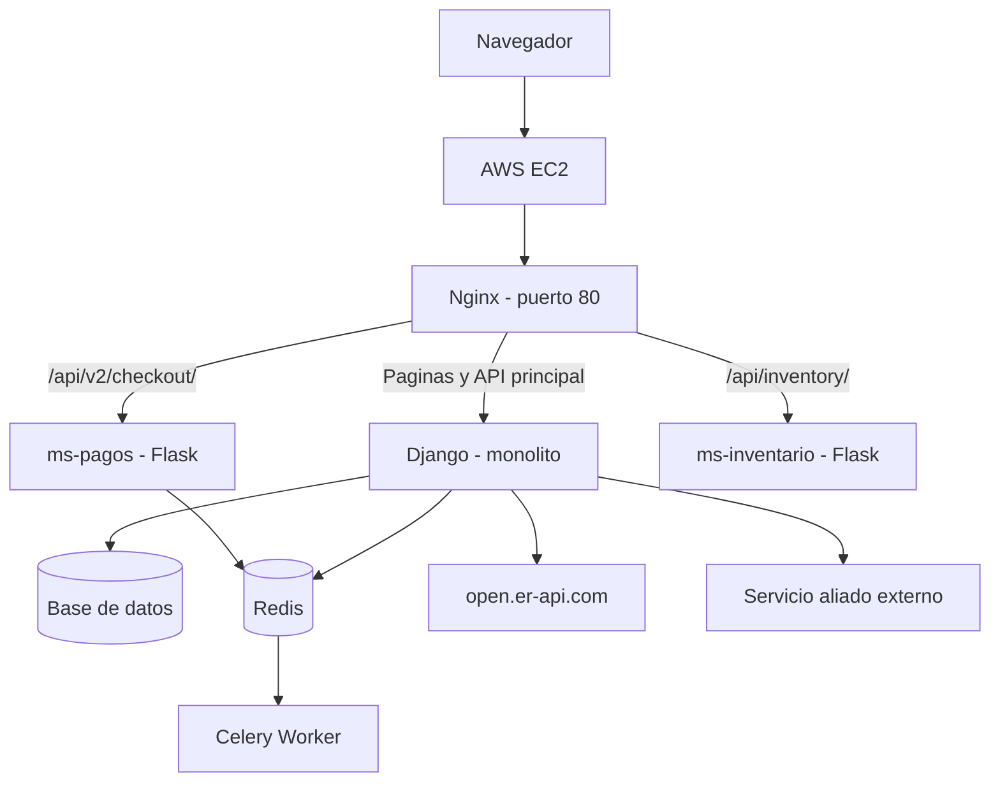
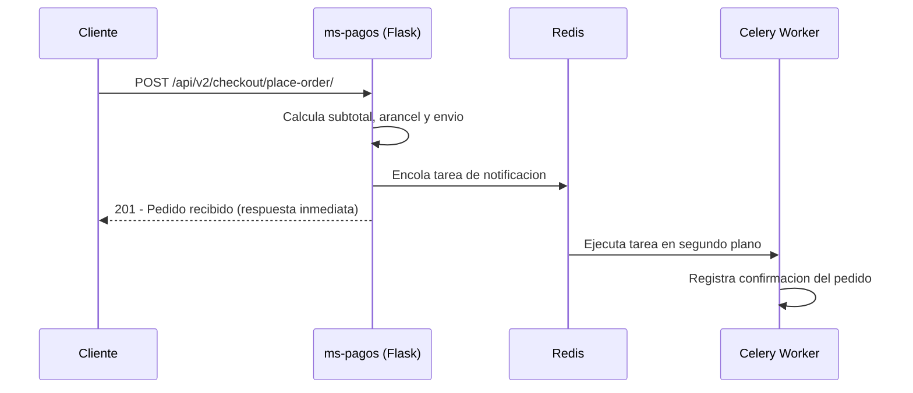
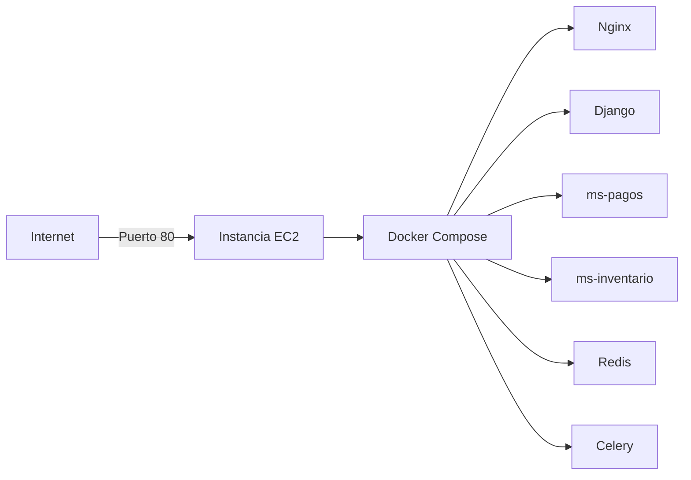

# Ropium

**Fecha:** 14/04/26  
**Integrantes:** Cristian Cabezas, Juanes Villada y Miguel Correa

## Descripcion del proyecto

Ropium es una tienda web de ropa y accesorios importados. Permite ver un catalogo de productos, agregar articulos al carrito, ver precios en pesos colombianos y en dolares, y finalizar un pedido con datos de envio.

El proyecto empezo como un monolito en Django y fue evolucionando hacia una arquitectura con microservicios, tareas en segundo plano y conexion con servicios externos.

---

## Arquitectura general

El sistema corre en un servidor de AWS EC2. Nginx recibe todas las peticiones del navegador y las distribuye entre los distintos servicios segun la ruta.



### Rutas que maneja Nginx

| Ruta | Servicio |
|------|----------|
| `/` y paginas del frontend | Django |
| `/api/products/`, `/api/orders/` | Django |
| `/api/exchange-rate/`, `/api/status/` | Django |
| `/api/v2/checkout/place-order/` | ms-pagos (Flask) |
| `/api/inventory/` | ms-inventario (Flask) |

---

## Flujo de un pedido

Cuando alguien hace un pedido desde el checkout, el flujo es el siguiente:



El cliente recibe respuesta de inmediato. La notificacion se procesa despues, sin bloquear la respuesta.

---

## Despliegue en AWS



Todos los servicios corren como contenedores Docker dentro de la misma instancia EC2. Nginx es el unico que expone un puerto al exterior.

---

## Novedades de este entregable

### Soporte en dos idiomas

La aplicacion esta disponible en espanol e ingles. El usuario puede cambiar el idioma desde cualquier pagina usando el selector en la barra de navegacion. Todos los textos del frontend estan traducidos, incluyendo las notificaciones del carrito.

### Precio en dolares

El catalogo, el carrito y el resumen del checkout muestran cada precio en pesos colombianos y tambien su equivalente aproximado en dolares. La tasa de cambio se consulta en tiempo real desde `open.er-api.com`.

Si el servicio externo no responde, se usa una tasa de respaldo de $4.100 COP por dolar.

### Tareas en segundo plano con Celery

Cuando se crea un pedido (ya sea desde Django o desde el microservicio Flask), se encola una tarea en Redis que Celery procesa de forma asincrona. Esto permite que el servidor responda rapido y deje trabajos como notificaciones o registros para despues.

### Dos microservicios Flask

- **ms-pagos**: procesa el checkout con calculo de arancel de importacion (8%) y costo de envio fijo.
- **ms-inventario**: servicio independiente para consultas de inventario.

### Servicio aliado

Django puede consumir un servicio externo de un equipo aliado. La URL se configura por variable de entorno (`ALLIED_SERVICE_URL`). Si el servicio no esta disponible, la aplicacion responde con un estado de error sin caerse.

---

## Patrones de diseno aplicados

| Patron | Donde se usa |
|--------|--------------|
| Strangler Pattern | Migracion gradual del checkout de Django a Flask |
| Adapter + DIP | Conexion con la API de tasa de cambio y el servicio aliado |
| Builder Pattern | Construccion y validacion de pedidos |
| Factory Pattern | Seleccion del tipo de notificador (MOCK o REAL) |
| Service Layer | Logica de negocio separada de las vistas |

---

## Como correr el proyecto localmente

```bash
docker compose down -v
docker compose up --build
```

Cuando los contenedores esten listos, abrir en el navegador:

```
http://localhost/
```

### Endpoints principales

```
GET  /api/products/                        Lista de productos
POST /api/orders/                          Crear pedido (Django)
POST /api/v2/checkout/place-order/         Crear pedido (Flask)
GET  /api/exchange-rate/                   Tasa de cambio USD/COP
GET  /api/status/                          Estado del sistema
GET  /api/allied/                          Consulta al servicio aliado
```

### Ejemplo de pedido

```json
POST /api/v2/checkout/place-order/
{
  "customer_email": "cliente@correo.com",
  "items": [{ "product_id": 1, "qty": 2 }],
  "address": {
    "city": "Medellin",
    "address_line": "Cra 45 # 10-20"
  }
}
```

---

## Tecnologias

- Python, Django, Django REST Framework
- Flask
- Celery + Redis
- Nginx
- Docker y Docker Compose
- AWS EC2
- Bootstrap, JavaScript
- SQLite
